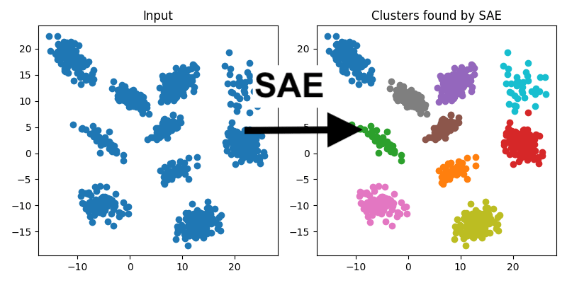

# sae ≡ k-means

**top-1 sparse autoencoder selection is mathematically equivalent to k-means cluster assignment.**

formally verified in lean 4.


---

## overview

k-means is one of the most widely used algorithms in machine learning. sparse autoencoders (saes) have recently gained attention for interpretability research. this work shows they're doing the same thing—under natural conditions, sae top-1 latent selection is exactly equivalent to k-means cluster assignment.

this equivalence is under-appreciated and has practical implications: saes offer advantages over k-means including gpu parallelism, gradient-based optimization, continual learning, and potentially automatic cluster selection via live neuron counts.

---

## the equivalence

k-means assigns each point to its nearest centroid:
```
cluster(x) = argmin_i ‖x - cᵢ‖²
```


an sae encoder computes:
```
z = ReLU(Wx)
```

and top-1 selection picks the most activated latent:
```
top1(x) = argmax_i zᵢ
```


we prove that when sae weights correspond to normalized centroids, these two operations produce identical assignments.



---

## the math

turns out there's a clean equivalence. three steps:

### 1. distance decomposition

expand the squared distance:
```
‖x - c‖² = ‖x‖² - 2⟨x, c⟩ + ‖c‖²
```

### 2. normalized centroids flip argmin to argmax

if centroids are unit norm (`‖cᵢ‖ = 1`), the constant terms don't affect ordering:
```
argmin_i ‖x - cᵢ‖² = argmax_i ⟨x, cᵢ⟩
```

closest centroid = highest dot product.

### 3. relu preserves argmax

as long as the max is positive:
```
a > b, a > 0  →  ReLU(a) > ReLU(b)
```

### putting it together

if your sae weights *are* the normalized centroids, then:

```
argmax_i ReLU(⟨cᵢ, x⟩)  =  argmin_i ‖x - cᵢ‖²
         ↑                         ↑
     sae top-1                  k-means
```

the two methods select the same index.


---

## the lean proof

the equivalence is formalized in lean 4 using mathlib. see [`lean/equivalence.lean`](lean/equivalence.lean).

key theorems:
- `distance_decomposition` — the algebraic expansion
- `argmin_dist_eq_argmax_inner` — normalized centroids flip the optimization direction
- `relu_mono` — relu preserves ordering for positive values
- `sae_kmeans_equivalence` — the main equivalence result
- `sae_kmeans_with_constant_bias` — extension to constant bias terms

**verification log:**
```
✔ [2267/2269] Replayed Mathlib.Analysis.InnerProductSpace.PiL2
✔ [2268/2269] Built equivalence (2.2s)
✔ [2269/2269] Ran «sae-kmeans»/equivalence:default
Build completed successfully (2269 jobs).
```

full build log: [`lean/build.log`](lean/build.log)

---

## why sae over k-means?

given mathematical equivalence, why prefer saes?

| property | k-means | sae |
|----------|---------|-----|
| gpu parallelism | limited | native |
| gradient optimization | ✗ | ✓ |
| continual learning | restart required | incremental updates |
| automatic k selection | manual | live neuron count |
| interpretability | centroids | feature directions |

the sae formulation also opens connections to reconstruction objectives and sparsity penalties that k-means lacks.

---

## repository structure

```
sae-kmeans/
├── lean/           # formal proof in lean 4
├── tex/            # latex writeup
├── manim/          # visualizations
└── README.md
```

---

## building

**lean proof:**
```bash
lake exe cache get
lake build
```

**latex:**
```bash
cd tex && pdflatex sae_kmeans_equivalence.tex
```

**manim:**
```bash
cd manim && manim -pql equivalence.py SAEKMeansEquivalence
```

---

## references

**core theory:**
- hess, s., duivesteijn, w., & mocanu, d. (2020). [softmax-based classification is k-means clustering](https://arxiv.org/abs/2001.01987). arXiv. — *proves softmax top-1 = k-means assignment*
- cho, m., et al. (2022). [dkm: differentiable k-means clustering layer](https://openreview.net/forum?id=J_gDq4xURo). ICLR. — *proves the reverse: k-means as attention*

**sparse autoencoders:**
- gao, l., et al. (2024). [scaling and evaluating sparse autoencoders](https://arxiv.org/abs/2406.04093). OpenAI. — *topk saes with hard feature selection*
- cunningham, h., et al. (2023). [sparse autoencoders find highly interpretable features](https://arxiv.org/abs/2309.08600). ICLR 2024.
- bricken, t., et al. (2023). [towards monosemanticity](https://transformer-circuits.pub/2023/monosemantic-features). Anthropic.

**clustering-representation connection:**
- snell, j., swersky, k., & zemel, r. (2017). [prototypical networks for few-shot learning](https://arxiv.org/abs/1703.05175). NeurIPS. — *prototypes = cluster centroids*
- li, y., et al. (2024). [the geometry of concepts: sparse autoencoder feature structure](https://arxiv.org/abs/2410.19750). Entropy 2025.

**concept bottlenecks:**
- koh, p.w., et al. (2020). [concept bottleneck models](https://proceedings.mlr.press/v119/koh20a.html). ICML.
- shani, c., vreeken, j., & shahaf, d. (2023). [towards concept-aware large language models](https://aclanthology.org/2023.findings-emnlp.877). EMNLP Findings.

---

## acknowledgments

research conducted at algoverse. thanks to daniel fein for the core insight and direction on this work.
